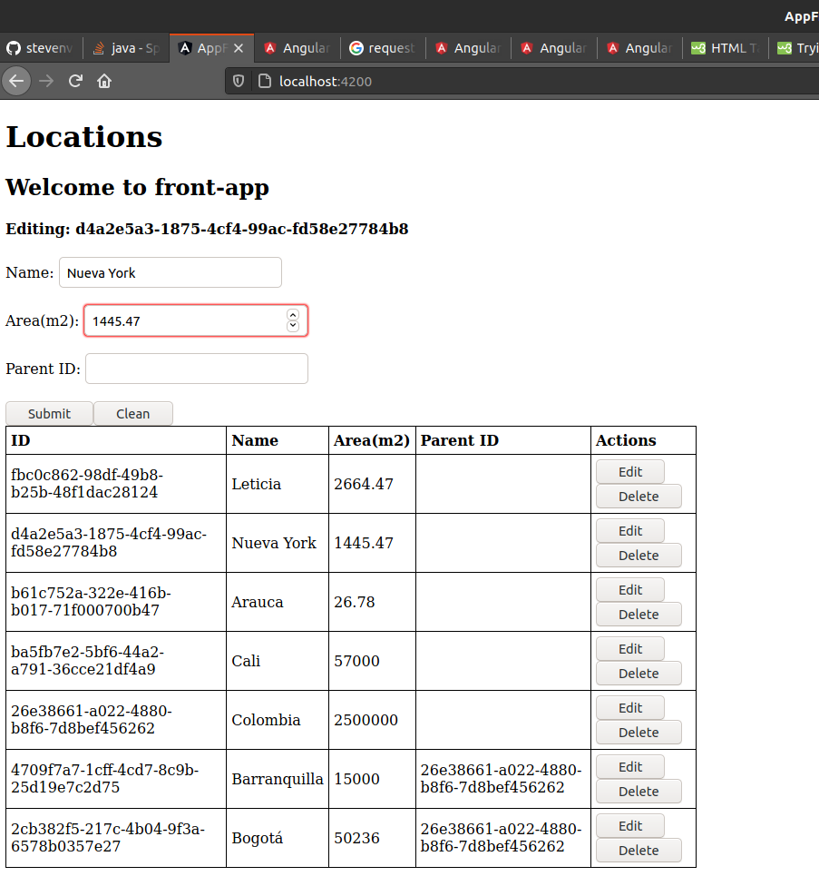

# test2_bogota

## **Punto 3** 

#### Iniciar contenedor de base de datos postgres:
dentro de test2_bogota:

	sudo docker-compose up

#### Iniciar aplicación java:
dentro de test2_bogota/app:

	./mvnw spring-boot:run -e

#### Iniciar front (http://localhost:4200/):
dentro de test2_bogota/app-front:

	ng serve

#### Usando API:

##### **Crear location:**

petición POST al recurso **http://localhost:8080/api/v1/location**, enviando JSON con la forma, en donde **parentLoc** sería el id de la localización padre:

		{
			"name": "Nueva York",
			"area_m2": "1445.467",
			"parentLoc": null
		}

##### **Obtener todos los location:**

petición GET al recurso **http://localhost:8080/api/v1/location**

##### **Obtener location por medio del id:**

petición GET al recurso **http://localhost:8080/api/v1/location/{ID}**  (reemplazar "{ID}" por el id de la localización)

##### **Editar location:**

petición PUT al recurso **http://localhost:8080/api/v1/location/{ID}**  (reemplazar "{ID}" por el id del location), enviando JSON con la forma:

	{
		"name": "Cali edited"
	}

##### **Eliminar location:**

petición DELETE al recurso **http://localhost:8080/api/v1/location/{ID}** (reemplazar "{ID}" por el id del location)

